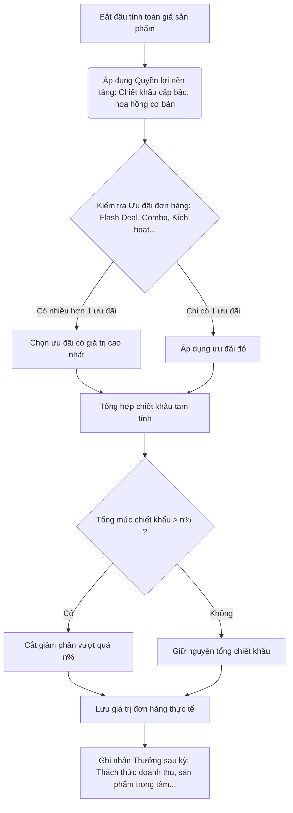

# Kế hoạch Phát triển Hệ thống Push Sale - VINAGO

Tài liệu này đề xuất kế hoạch phát triển chi tiết cho **14 chương trình kích thích doanh số (Push Sale)** dựa trên tài liệu mô tả nghiệp vụ của VINAGO. Kế hoạch này được cấu trúc thành các giai đoạn thiết kế, phát triển và tích hợp hệ thống.

---

## 1. Thiết kế Cơ chế Tính toán & Quy tắc Chung (Core Engine)

Đây là phần nền tảng quan trọng nhất cần xây dựng trước khi bắt đầu các chương trình chi tiết, nhằm kiểm soát ngân sách và tránh xung đột ưu đãi.

### Quy tắc Cộng dồn & Áp dụng


### Các nhóm ưu đãi chính cần quản lý:
1. **Nhóm 1: Ưu đãi nền tảng (Luôn áp dụng)**: Chiết khấu theo phân hạng đối tác/đại lý, hoa hồng cơ bản.
2. **Nhóm 2: Ưu đãi trực tiếp trên đơn hàng (Chỉ chọn 1 ưu đãi tốt nhất)**:
   - Ưu đãi kích hoạt tài khoản mới.
   - Flash Deal.
   - Kho ưu đãi đặc biệt (hàng tồn kho lâu ngày).
   - Combo sản phẩm bổ trợ / Combo gói sản phẩm.
   - Ưu đãi mở rộng ngành hàng mới.
3. **Nhóm 3: Thưởng sau kỳ (Tính toán định kỳ cuối tháng/quý và có thể cộng dồn với Nhóm 2)**:
   - Thách thức doanh số tháng/quý.
   - Doanh số sản phẩm trọng tâm.
   - Thưởng chuỗi mua hàng liên tục (giữ chuỗi).
   - Thách thức cộng đồng / Thi đua nhóm.

---

## 2. Lộ trình Triển khai (3 Giai đoạn)

### Giai đoạn 1: Nền tảng & Kích cầu Giao dịch (Giai đoạn hiện tại)
*Tập trung vào các chương trình kích thích trực tiếp trên đơn hàng và tạo động lực mua hàng ngay khi đăng ký.*

#### Các tính năng phát triển:
1. **Ưu đãi kích hoạt**:
   - Theo dõi tài khoản mới kích hoạt.
   - Thiết lập thời hạn hoàn thành đơn đầu tiên (3 ngày) và đơn thứ hai ([n] ngày).
   - Giao diện đếm ngược thời gian ưu đãi trên ứng dụng Mobile.
2. **Flash Deal**:
   - Thiết lập khung giờ vàng (chạy theo giờ), giới hạn số lượng sản phẩm khuyến mãi.
   - Đồng hồ đếm ngược và thanh tiến độ mua hàng thực tế trên Mobile.
   - Tự động hoàn giá về mức gốc khi hết giờ hoặc hết số lượng.
3. **Kho ưu đãi đặc biệt (Giải phóng hàng tồn)**:
   - Tab riêng biệt hiển thị hàng tồn kho lâu năm (ví dụ: >90 ngày) với giá giảm đặc biệt.
   - Tự động ẩn sản phẩm khi hết hàng tồn kho quy định.
4. **Combo sản phẩm bổ trợ (Mua A giảm/tặng B)**:
   - Đề xuất combo bổ trợ trên trang chi tiết sản phẩm và Giỏ hàng.
   - Thiết lập quy tắc mua combo linh hoạt.
5. **Đặt trước mùa vụ**:
   - Nhận đơn đặt hàng trước khi hàng về, ghi nhận cam kết số lượng.
   - Thiết lập cơ chế khóa tiền bảo lãnh đối với nhóm khách hàng rủi ro cao.
   - Tính toán chiết khấu tăng thêm khi giao hàng thành công theo cam kết.
6. **Bảng xếp hạng DTT (Doanh thu thuần)**:
   - Bảng xếp hạng theo thời gian thực dựa trên DTT đã thanh toán của đại lý theo nhóm/cấp bậc/khu vực.
   - Hiển thị thứ hạng cá nhân, khoảng cách DTT so với người xếp trên.

---

### Giai đoạn 2: Giữ chân Khách hàng & Tăng trưởng Quy mô (Xây dựng sau khi ứng dụng ổn định)
*Tập trung vào các mục tiêu dài hạn cá nhân hóa để đại lý mua hàng liên tục và đa dạng hóa danh mục sản phẩm nhập.*

#### Các tính năng phát triển:
1. **Thách thức tháng/quý**:
   - Tự động tính mục tiêu doanh thu cá nhân dựa trên lịch sử cùng kỳ.
   - Hiển thị thanh tiến độ thực hiện mục tiêu trên Mobile.
   - Tính thưởng chiết khấu bậc thang (100%, 120%, 150%) cuối kỳ.
2. **Sản phẩm trọng tâm tháng**:
   - Đẩy mạnh một số mã hàng chỉ định, theo dõi doanh số riêng từng mã để thưởng.
3. **Mở rộng ngành hàng (Cá nhân hóa gợi ý)**:
   - Phân tích lịch sử đặt hàng để phát hiện ngành hàng đại lý chưa từng nhập.
   - Tự động gửi thông báo đẩy (push notification) kèm ưu đãi cho đơn đầu tiên của ngành hàng mới.
4. **Mua hàng không gián đoạn (Giữ chuỗi)**:
   - Theo dõi chuỗi tháng mua hàng liên tiếp đạt doanh thu tối thiểu.
   - Thưởng huy hiệu và quà tặng tại các mốc (3 tháng, 6 tháng, 12 tháng...).
5. **Combo gói sản phẩm**:
   - Gói combo cố định nhiều mặt hàng để nhận giá ưu đãi tổng.

---

### Giai đoạn 3: Gamification & Mạng lưới Cộng đồng (Nâng cấp dài hạn)
*Kết nối các đại lý với nhau để tạo hiệu ứng mạng lưới và nâng cao nhận diện thương hiệu.*

#### Các tính năng phát triển:
1. **Thách thức cộng đồng**:
   - Phát động thách thức toàn hệ thống đạt một cột mốc doanh số chung (ví dụ: máy cắt cỏ đạt 10 tỷ).
   - Thanh tiến độ chung toàn hệ thống cập nhật liên tục.
2. **Thi đua theo nhóm/khu vực**:
   - Chia nhóm đại lý theo tỉnh thành/khu vực địa lý để thi đua nhận thưởng tập thể.
3. **Giới thiệu khách hàng (Referral)**:
   - Mỗi đại lý có mã giới thiệu riêng.
   - Nhận hoa hồng/thưởng tự động khi người được giới thiệu hoàn thành đơn hàng đầu tiên.

---

## 3. Kiến trúc Cơ sở Dữ liệu & Thiết kế API (Giai đoạn 1)

### Thiết kế Bảng CSDL (Tham khảo cho Spring Boot JPA)

#### 1. Bảng Chương trình Khuyến mại (`promotions`)
Quản lý các chương trình ưu đãi cơ bản như Kích hoạt, Flash Deal, Combo, Ưu đãi đặc biệt.
```sql
CREATE TABLE promotions (
    id BIGSERIAL PRIMARY KEY,
    name VARCHAR(255) NOT NULL,
    description TEXT,
    promo_type VARCHAR(50) NOT NULL, -- 'ACTIVATION', 'FLASH_DEAL', 'SPECIAL_OFFER', 'COMBO', 'PRE_ORDER'
    discount_type VARCHAR(50) NOT NULL, -- 'PERCENTAGE', 'FIXED_AMOUNT', 'GIFT_PRODUCT'
    discount_value DECIMAL(12, 2) NOT NULL,
    min_order_value DECIMAL(12, 2) DEFAULT 0,
    start_date TIMESTAMP NOT NULL,
    end_date TIMESTAMP NOT NULL,
    status VARCHAR(50) DEFAULT 'ACTIVE',
    max_usage_per_user INT DEFAULT 1,
    limit_quantity INT DEFAULT -1, -- Giới hạn số lượng cho Flash Deal
    sold_quantity INT DEFAULT 0,
    created_date TIMESTAMP DEFAULT CURRENT_TIMESTAMP
);
```

#### 2. Bảng Quan hệ Sản phẩm Khuyến mại (`promotion_products`)
```sql
CREATE TABLE promotion_products (
    promotion_id BIGINT REFERENCES promotions(id) ON DELETE CASCADE,
    product_id BIGINT REFERENCES products(id) ON DELETE CASCADE,
    PRIMARY KEY (promotion_id, product_id)
);
```

#### 3. Bảng Theo dõi Đặt trước Mùa vụ (`pre_orders`)
```sql
CREATE TABLE pre_orders (
    id BIGSERIAL PRIMARY KEY,
    agency_id BIGINT NOT NULL,
    product_id BIGINT REFERENCES products(id),
    committed_quantity INT NOT NULL,
    delivered_quantity INT DEFAULT 0,
    status VARCHAR(50) DEFAULT 'PENDING', -- 'PENDING', 'PARTIAL', 'COMPLETED', 'CANCELLED'
    lock_deposit_amount DECIMAL(12, 2) DEFAULT 0,
    created_date TIMESTAMP DEFAULT CURRENT_TIMESTAMP
);
```

#### 4. Bảng Xếp hạng Doanh thu Thuần (`leaderboards`)
```sql
CREATE TABLE leaderboards (
    id BIGSERIAL PRIMARY KEY,
    name VARCHAR(255) NOT NULL,
    start_date TIMESTAMP NOT NULL,
    end_date TIMESTAMP NOT NULL,
    leaderboard_type VARCHAR(50) NOT NULL, -- 'NET_REVENUE', 'GROWTH', 'NEW_CUSTOMER'
    target_group VARCHAR(50), -- 'GOLD', 'PLATINUM', 'ALL'
    status VARCHAR(50) DEFAULT 'ACTIVE'
);
```

### Các Endpoint API chính cần phát triển (Backend)

- **Ưu đãi kích hoạt & Flash Deal**:
  - `GET /api/promotions/active` - Lấy danh sách ưu đãi và Flash Deal đang diễn ra (bao gồm thông tin thời gian còn lại, số lượng đã bán).
  - `GET /api/promotions/activation-status` - Lấy trạng thái đếm ngược ưu đãi kích hoạt của người dùng hiện tại.
- **Đặt trước**:
  - `POST /api/pre-orders` - Tạo đơn cam kết đặt trước.
  - `GET /api/pre-orders/my-commitments` - Xem lịch sử đặt trước và trạng thái thực hiện cam kết.
- **Bảng xếp hạng**:
  - `GET /api/leaderboards/{id}/ranks` - Lấy bảng xếp hạng hiện tại và vị trí của người dùng hiện tại (kèm theo 2 người trên và 2 người dưới).

---

## 4. Các điểm cần Làm rõ & Quyết định (Open Questions)

> [!IMPORTANT]
> **1. Giới hạn chiết khấu tối đa [n]% là bao nhiêu?**
> Cần xác định con số cụ thể cho tổng hoa hồng + chiết khấu trên cùng 1 sản phẩm để đưa vào cấu hình hệ thống (ví dụ: tối đa 35%).
> 
> **2. Quy trình khóa tiền bảo lãnh với KH rủi ro cao trong chương trình "Đặt trước"?**
> Cần định nghĩa rõ tiêu chí tự động xác định khách hàng rủi ro cao dựa trên số ngày nợ quá hạn hoặc công nợ hiện tại để hệ thống thực hiện tạm khóa tiền bảo lãnh tự động.
> 
> **3. Pháp lý chương trình "Giới thiệu khách hàng" (Giai đoạn 3)?**
> Cần kiểm tra kỹ cơ chế thưởng hoa hồng theo doanh thu của người được giới thiệu trong thời gian [n] tháng để tránh các rủi ro pháp lý liên quan đến luật kinh doanh đa cấp (MLM).
